# gDRplots

## Overview

The `gDRplots` package belongs to the `gDR` suite app.

## Content

The `gDRplots` package stores functions for gDR static visualizations
and their dedicated helpers. The package allows users to visualize
different metrics for combinations of drugs and cell lines of interest,
both during and after processing.

The `gDRplots` package supports the following metrics:

| Metrics                | Definition                                                                                                                   |
|------------------------|------------------------------------------------------------------------------------------------------------------------------|
| **GR value**           | Normalized Growth Rate (GR) value; calculated by normalizing treated samples with the corresponding vehicle-treated samples. |
| **Relative Viability** | (RV); calculated by normalizing treated samples with the corresponding vehicle-treated samples.                              |

**Assumptions**

1.  input data

All plot functions require as an input `data.table` representation of
the data in selected assay with added information from `colData` created
based on the gDR data model (MultiAssayExperiment). such format is
provided by the
[`gDRutils::convert_se_assay_to_dt`](https://gdrplatform.github.io/gDRstyle/reference/convert_se_assay_to_dt.html)
function.

More details about the gDR data model user can find in the
[gDRcore](https://www.bioconductor.org/packages/release/bioc/html/gDRcore.html)
package.

2.  function naming convention

If a function is dedicated to only one type of experiment - it will be
marked in the name with the symbol **sa** for an experiment with a
single-agent (e.g. `pheatmap_with_anno_sa`) or **combo** - for a
combined experiment (e.g. `pheatmap_with_anno_combo`).

3.  function output

Basically all functions return **a ggplot object**, except for a few
that return **a pheatmap object**. But this is indicated in the function
names and description, e.g. `pheatmap_qc`, `pheatmap_with_anno_sa`, and
`pheatmap_with_anno_combo`.

There is a group of functions that return **a panel** with a group of
basic plots. The name of these functions always contains a word
**panel**. E.g. a basic ggplot object - *one heatmap* for selected drug,
co-drug and one cell line - is returned by `heatmap_combo_with_isoref`.
And `heatmap_combo_with_isoref_panel` returns a ggplot object with *a
panel with heatmaps* for selected drug, co-drug and list of cell lines.

Used data:

- single-agent experiment

``` r
mae <- gDRutils::get_synthetic_data("combo_matrix")
sa_name <- gDRutils::get_supported_experiments("sa")
se_sa <- mae[[sa_name]]

dt_norm_sa <-
  gDRutils::convert_se_assay_to_dt(se = se_sa,
                                   assay_name =  "Normalized",
                                   unify_metadata = TRUE,
                                   merge_additional_variables = TRUE)
dt_metrics_sa <-
  gDRutils::convert_se_assay_to_dt(se = se_sa,
                                   assay_name = "Metrics",
                                   unify_metadata = TRUE,
                                   merge_additional_variables = TRUE)
dt_average_sa <-
  gDRutils::convert_se_assay_to_dt(se = se_sa,
                                   assay_name = "Averaged",
                                   unify_metadata = TRUE,
                                   merge_additional_variables = TRUE)
dt_metrics_sa_capped <-
 gDRutils::cap_assay_infinities(conc_assay_dt = dt_average_sa,
                                assay_dt = dt_metrics_sa,
                                experiment_name = sa_name,
                                col = "xc50",
                                capping_fold = 5)
```

- codilution experiment

``` r
mae <- gDRutils::get_synthetic_data("combo_codilution_small")
cd_name <- gDRutils::get_supported_experiments("cd")
se_cd <- mae[[cd_name]]

dt_norm_cd <-
  gDRutils::convert_se_assay_to_dt(se = se_cd,
                                   assay_name =  "Normalized",
                                   unify_metadata = TRUE,
                                   merge_additional_variables = TRUE)
dt_metrics_cd <-
  gDRutils::convert_se_assay_to_dt(se = se_cd,
                                   assay_name = "Metrics",
                                   unify_metadata = TRUE,
                                   merge_additional_variables = TRUE)
dt_average_cd <-
  gDRutils::convert_se_assay_to_dt(se = se_cd,
                                   assay_name = "Averaged",
                                   unify_metadata = TRUE,
                                   merge_additional_variables = TRUE)
```

- combination experiment

``` r
mae <- gDRutils::get_synthetic_data("combo_matrix")
combo_name <- gDRutils::get_supported_experiments("combo")
se_combo <- mae[[combo_name]]

dt_norm_combo <-
  gDRutils::convert_se_assay_to_dt(se = se_combo,
                                   assay_name =  "Normalized",
                                   unify_metadata = TRUE,
                                   merge_additional_variables = TRUE)
dt_metrics_combo <-
  gDRutils::convert_se_assay_to_dt(se = se_combo,
                                   assay_name = "Metrics",
                                   unify_metadata = TRUE,
                                   merge_additional_variables = TRUE)
dt_average_combo <-
  gDRutils::convert_se_assay_to_dt(se = se_combo,
                                   assay_name = "Averaged",
                                   unify_metadata = TRUE,
                                   merge_additional_variables = TRUE)
dt_scores <-
  gDRutils::convert_se_assay_to_dt(se = se_combo,
                                   assay_name = "scores",
                                   unify_metadata = TRUE,
                                   merge_additional_variables = TRUE)
dt_excess <-
  gDRutils::convert_se_assay_to_dt(se = se_combo,
                                   assay_name = "excess",
                                   unify_metadata = TRUE,
                                   merge_additional_variables = TRUE)
dt_isobolograms <-
  gDRutils::convert_se_assay_to_dt(se = se_combo,
                                   assay_name = "isobolograms",
                                   unify_metadata = TRUE,
                                   merge_additional_variables = TRUE)
```

  

**TIP**  
It is highly recommended to use
[`gDRutils::convert_se_assay_to_dt`](https://gdrplatform.github.io/gDRstyle/reference/convert_se_assay_to_dt.html)
with `unify_metadata = TRUE` and `merge_additional_variables = TRUE`.
This prevents errors caused by non-unique combinations of values in the
`DrugName` and `CellLineName` columns.

### Dose Response Plots

The dose-response plots are classic visualizations of drug response
curves in a consolidated way.

The overview with many curves presented on the same scale gives the user
a comprehensive view of the dataset. This is particularly useful in
large compound screening datasets, where a drug with a universal
resistance pattern across all cell lines can be easily identified. The
compound generates different sigmoid curves, suggesting inhibitory or
cytotoxic effects, which are worth exploring further.

#### Single-agent Data

The **plot_dose_response_sa** function is dedicated to single-agent
experiments.

Users can also use **plot_dose_response_sa_by_CLs** or
**plot_dose_response_sa_by_drugs** to get a list of dose-response plots
by cell line names or by drugs accordingly.

``` r
plot_dose_response_sa(
  dt_metrics = dt_metrics_sa,
  dt_average = dt_average_sa,
  selection_name = "drug_002",
  group_var = "CellLineName",
  group_names = c("cellline_BC", "cellline_FD", "cellline_JE"))
```

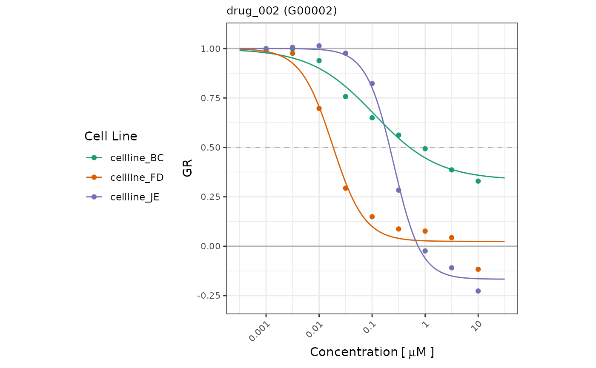

#### Combination Data

The **plot_dose_response_combo** function is dedicated to combination
experiments.

Users can also use **plot_dose_response_combo_panel** to get a panel
with dose-response plots by selected cell line name.

``` r
plot_dose_response_combo(dt_average = dt_average_combo,
                         drug1_name = "drug_011",
                         drug2_name = "drug_021",
                         cl_name = "cellline_NE")
```

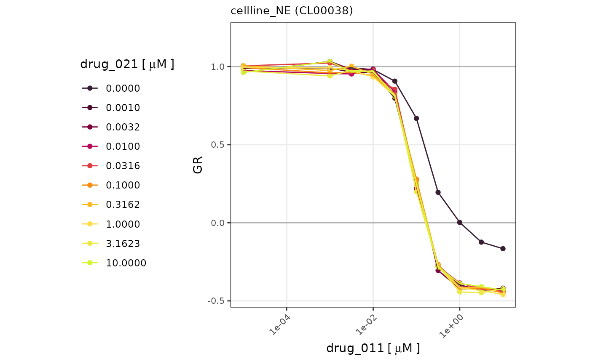

### Metrics plot

A heat map built for all combinations of drugs and cell lines, colored
according to the value of the selected metric, is a very common way to
explore datasets. Boxplots are also commonly used to explore the
distribution of metric values across interest groups.

#### Single-agent Data

The **pheatmap_with_anno_sa** function is dedicated to single-agent
experiments to generate a heatmap.

Additionally, rows are annotated by `Tissue` and columns - by
`drug MOA`. Users can also use their own annotations.

This function returns the heatmap itself and a list of tables with data:
a matrix and annotation vectors.

``` r
annotation_manual_col <-
  unique(dt_metrics_sa[, c("CellLineName", "Tissue"), with = FALSE])
annotation_manual_row <-
  unique(dt_metrics_sa[, c("DrugName", "drug_moa"), with = FALSE])

output <- pheatmap_with_anno_sa(
  dt_metrics = dt_metrics_sa,
  dt_metrics_capped = dt_metrics_sa_capped,
  annotation_row = annotation_manual_row,
  annotation_col = annotation_manual_col)
hm <- output[["heatmap"]]
ggpubr::as_ggplot(hm[["gtable"]])
```

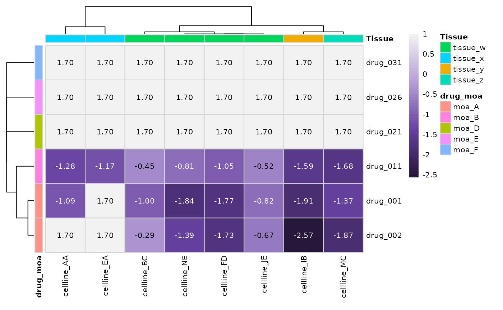

``` r

knitr::kable(output[["data"]][["matrix"]], escape = FALSE)
```

| CellLineName |  drug_001 |  drug_002 |  drug_011 | drug_021 | drug_026 | drug_031 |
|:-------------|----------:|----------:|----------:|---------:|---------:|---------:|
| cellline_BC  | 0.0998809 | 0.5089319 | 0.3520659 |      Inf |      Inf |      Inf |
| cellline_FD  | 0.0168777 | 0.0185318 | 0.0901472 |      Inf |      Inf |      Inf |
| cellline_JE  | 0.1519077 | 0.2153215 | 0.3027943 |      Inf |      Inf |      Inf |
| cellline_NE  | 0.0146204 | 0.0405016 | 0.1531716 |      Inf |      Inf |      Inf |
| cellline_AA  | 0.0807604 |       Inf | 0.0519747 |      Inf |      Inf |      Inf |
| cellline_EA  |       Inf |       Inf | 0.0679622 |      Inf |      Inf |      Inf |
| cellline_IB  | 0.0124117 | 0.0027211 | 0.0256661 |      Inf |      Inf |      Inf |
| cellline_MC  | 0.0424780 | 0.0135922 | 0.0207424 |      Inf |      Inf |      Inf |

The **plot_boxplot_metric_sa_by_CLs** and
**plot_boxplot_metric_sa_by_drugs** functions are dedicated to
single-agent experiments to generate boxplots grouped by `CellLineName`
or `DrugName`, respectively.

``` r
plot_boxplot_metric_sa_by_CLs(dt_metrics_sa_capped)
```

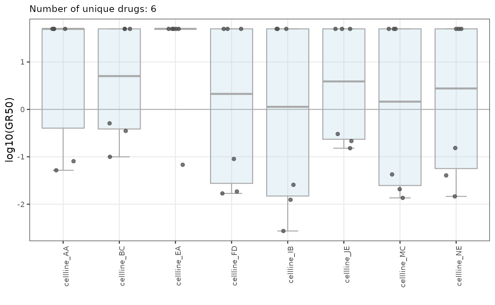

``` r
plot_boxplot_metric_sa_by_drugs(dt_metrics_sa_capped)
```

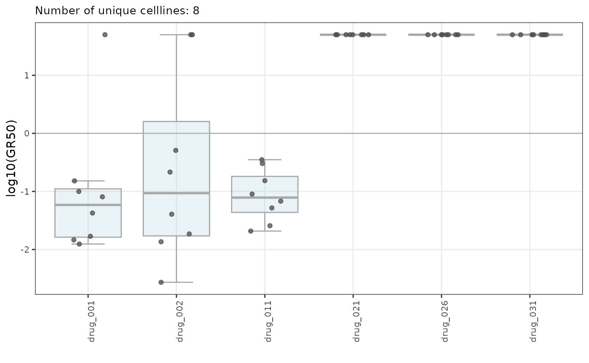

Additionally, user can colored boxplots by secondary variable - by
`Tissue` or `drug MOA` respectively.

``` r
plot_boxplot_metric_sa_by_CLs(dt_metrics_sa_capped,
                              grouped_flag = TRUE)
```

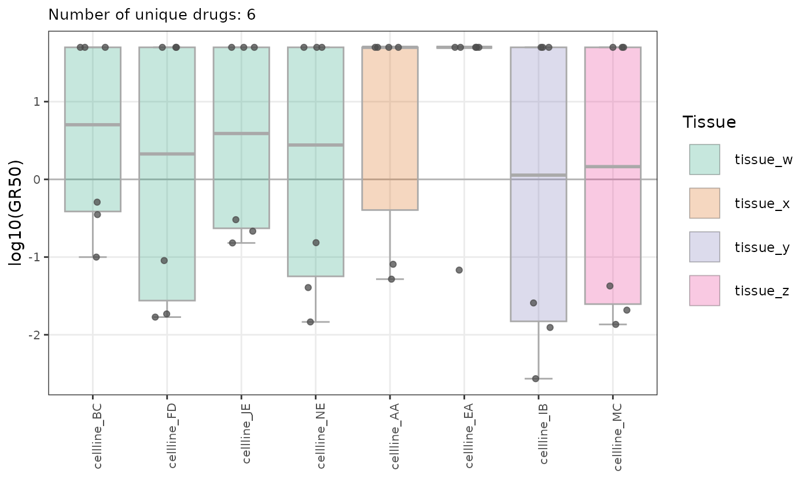

``` r
plot_boxplot_metric_sa_by_drugs(dt_metrics_sa_capped,
                                grouped_flag = TRUE)
```

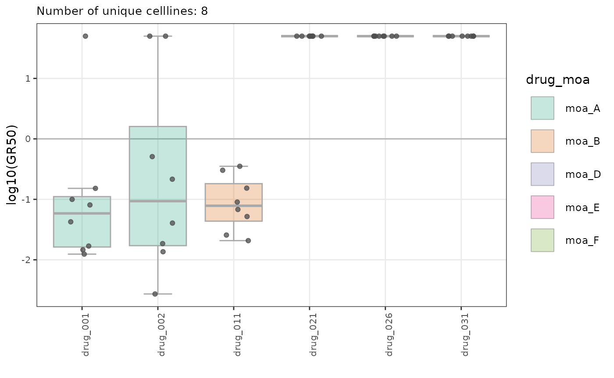

Or user can colored points by opposite primary variable - by `DrugName`
or `CellLineName` respectively.

``` r
plot_boxplot_metric_sa_by_CLs(dt_metrics_sa_capped,
                              colored_pts_flag = TRUE)
```

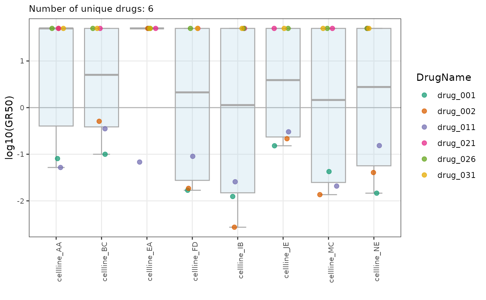

``` r
plot_boxplot_metric_sa_by_drugs(dt_metrics_sa_capped,
                                colored_pts_flag = TRUE)
```

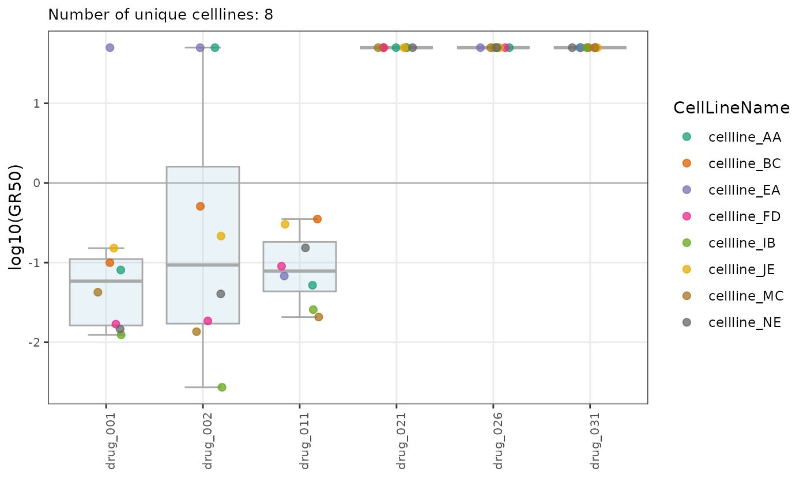

There is also a possibility to generate boxplot grouped by chosen
variable for dedicated `DrugName` or `CellLineName`. Additionally, the
n-bottom points are colored.

``` r
plot_boxplot_metric_sa_by_grp(dt_metrics_sa_capped,
                             selection_var = "DrugName",
                             selection_name = "drug_002",
                             group_var = "Tissue",
                             named_n = 3)
```

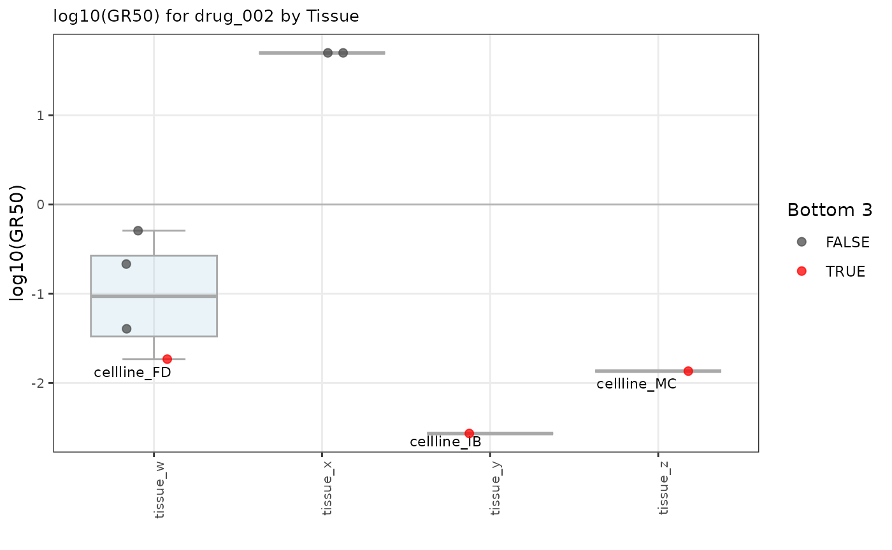

``` r
plot_boxplot_metric_sa_by_grp(dt_metrics_sa_capped,
                             selection_var = "CellLineName",
                             selection_name = "cellline_BC",
                             group_var = "drug_moa",
                             named_n = 3)
```

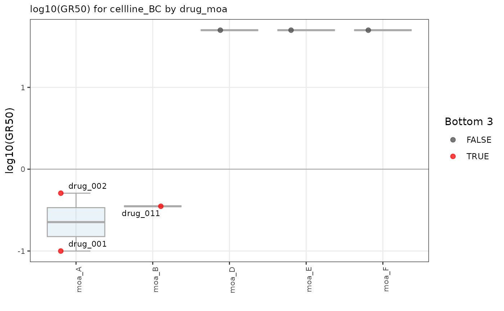

#### Co-dilution Data

The **pheatmap_with_anno_cd** function is dedicated to co-dilution
experiments to generate a heatmap.

Additionally, rows are annotated by `Tissue` and columns - by `drug MOA`
and `drug MOA 2`. Users can also use their own annotations.

This function returns the heatmap itself and a list of tables with data:
a matrix and annotation vectors.

``` r
annotation_manual_col <-
  unique(dt_metrics_cd[, c("CellLineName", "Tissue"), with = FALSE])
annotation_manual_row <-
  unique(dt_metrics_cd[, c("DrugName", "DrugName_2", "Concentration_2",
                           "drug_moa", "drug_moa_2"), with = FALSE])

output <- pheatmap_with_anno_cd(
  dt_metrics = dt_metrics_cd,
  annotation_row = annotation_manual_row,
  annotation_col = annotation_manual_col)
hm <- output[["heatmap"]]
ggpubr::as_ggplot(hm[["gtable"]])
```

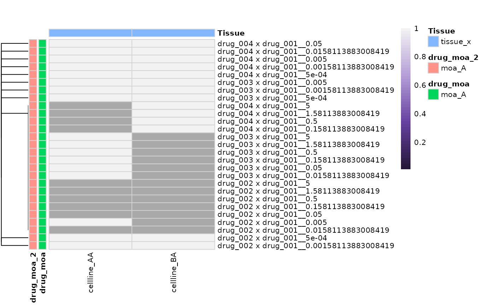

``` r

knitr::kable(output[["data"]][["matrix"]], escape = FALSE)
```

| CellLineName | drug_002 x drug_001\_\_5e-04 | drug_002 x drug_001\_\_0.00158113883008419 | drug_002 x drug_001\_\_0.005 | drug_002 x drug_001\_\_0.0158113883008419 | drug_002 x drug_001\_\_0.05 | drug_002 x drug_001\_\_0.158113883008419 | drug_002 x drug_001\_\_0.5 | drug_002 x drug_001\_\_1.58113883008419 | drug_002 x drug_001\_\_5 | drug_003 x drug_001\_\_5e-04 | drug_003 x drug_001\_\_0.00158113883008419 | drug_003 x drug_001\_\_0.005 | drug_003 x drug_001\_\_0.0158113883008419 | drug_003 x drug_001\_\_0.05 | drug_003 x drug_001\_\_0.158113883008419 | drug_003 x drug_001\_\_0.5 | drug_003 x drug_001\_\_1.58113883008419 | drug_003 x drug_001\_\_5 | drug_004 x drug_001\_\_5e-04 | drug_004 x drug_001\_\_0.00158113883008419 | drug_004 x drug_001\_\_0.005 | drug_004 x drug_001\_\_0.0158113883008419 | drug_004 x drug_001\_\_0.05 | drug_004 x drug_001\_\_0.158113883008419 | drug_004 x drug_001\_\_0.5 | drug_004 x drug_001\_\_1.58113883008419 | drug_004 x drug_001\_\_5 |
|:-------------|-----------------------------:|-------------------------------------------:|-----------------------------:|------------------------------------------:|----------------------------:|-----------------------------------------:|---------------------------:|----------------------------------------:|-------------------------:|-----------------------------:|-------------------------------------------:|-----------------------------:|------------------------------------------:|----------------------------:|-----------------------------------------:|---------------------------:|----------------------------------------:|-------------------------:|-----------------------------:|-------------------------------------------:|-----------------------------:|------------------------------------------:|----------------------------:|-----------------------------------------:|---------------------------:|----------------------------------------:|-------------------------:|
| cellline_AA  |                          Inf |                                        Inf |                          Inf |                                      -Inf |                        -Inf |                                     -Inf |                       -Inf |                                    -Inf |                     -Inf |                          Inf |                                        Inf |                          Inf |                                       Inf |                         Inf |                                      Inf |                        Inf |                                     Inf |                      Inf |                          Inf |                                        Inf |                          Inf |                                       Inf |                         Inf |                                     -Inf |                       -Inf |                                    -Inf |                     -Inf |
| cellline_BA  |                          Inf |                                        Inf |                         -Inf |                                      -Inf |                        -Inf |                                     -Inf |                       -Inf |                                    -Inf |                     -Inf |                          Inf |                                        Inf |                          Inf |                                      -Inf |                        -Inf |                                     -Inf |                       -Inf |                                    -Inf |                     -Inf |                          Inf |                                        Inf |                          Inf |                                       Inf |                         Inf |                                      Inf |                        Inf |                                     Inf |                      Inf |

#### Combination Data

The **pheatmap_with_anno_combo** function is dedicated to combination
experiments to generate a heatmap.

Additionally, rows are annotated by `Tissue` and columns - by `drug MOA`
and `co-drug MOA`. Users can also use their own annotations.

This function returns the heatmap itself and a list of tables with data:
a matrix and annotation vectors.

``` r
annotation_manual_col <-
  unique(dt_scores[, c("CellLineName", "Tissue"), with = FALSE])
annotation_manual_row <-
  unique(dt_scores[, c("DrugName", "DrugName_2",
                       "drug_moa", "drug_moa_2"), with = FALSE])

output <- pheatmap_with_anno_combo(
  dt_scores = dt_scores,
  annotation_row = annotation_manual_row,
  annotation_col = annotation_manual_col)
hm <- output[["heatmap"]]
ggpubr::as_ggplot(hm[["gtable"]])
```

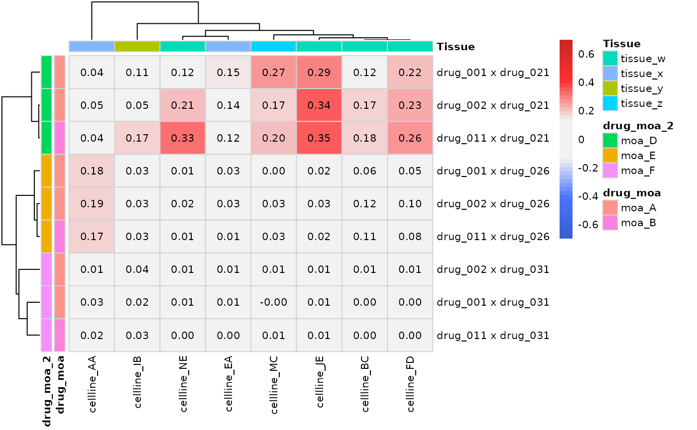

``` r

knitr::kable(output[["data"]][["matrix"]], escape = FALSE)
```

| CellLineName | drug_001 x drug_021 | drug_002 x drug_021 | drug_001 x drug_026 | drug_002 x drug_026 | drug_001 x drug_031 | drug_002 x drug_031 | drug_011 x drug_021 | drug_011 x drug_026 | drug_011 x drug_031 |
|:-------------|--------------------:|--------------------:|--------------------:|--------------------:|--------------------:|--------------------:|--------------------:|--------------------:|--------------------:|
| cellline_BC  |           0.1188462 |           0.1696683 |           0.0578628 |           0.1177968 |           0.0040957 |           0.0075757 |           0.1769825 |           0.1073843 |           0.0032548 |
| cellline_FD  |           0.2229644 |           0.2343402 |           0.0474401 |           0.0970419 |           0.0035730 |           0.0108944 |           0.2645697 |           0.0848330 |           0.0010406 |
| cellline_JE  |           0.2945933 |           0.3395875 |           0.0222295 |           0.0278835 |           0.0113068 |           0.0063923 |           0.3465100 |           0.0232805 |           0.0137852 |
| cellline_NE  |           0.1173599 |           0.2051338 |           0.0132184 |           0.0161967 |           0.0077477 |           0.0088354 |           0.3267055 |           0.0074874 |           0.0005292 |
| cellline_AA  |           0.0411628 |           0.0488968 |           0.1774548 |           0.1905333 |           0.0266574 |           0.0082791 |           0.0359905 |           0.1724894 |           0.0213411 |
| cellline_EA  |           0.1468862 |           0.1379605 |           0.0279377 |           0.0287112 |           0.0137568 |           0.0069382 |           0.1167003 |           0.0118499 |           0.0010357 |
| cellline_IB  |           0.1078013 |           0.0528896 |           0.0259983 |           0.0282770 |           0.0197343 |           0.0381455 |           0.1690969 |           0.0338534 |           0.0342115 |
| cellline_MC  |           0.2655205 |           0.1699915 |           0.0032402 |           0.0315052 |          -0.0027163 |           0.0074578 |           0.2030117 |           0.0311446 |           0.0127269 |

The **plot_boxplot_metric_sa_by_CLs** and
**plot_boxplot_metric_sa_by_drugs** functions are dedicated to
single-agent experiments to generate boxplots grouped by `CellLineName`
or combination of `DrugName` with `DrugName_2`, respectively.

Additionally, for boxplots grouped by `CellLineName` user can colored
boxplots by secondary variable - by `Tissue`.

``` r
plot_boxplot_metric_combo_by_CLs(dt_scores)
```

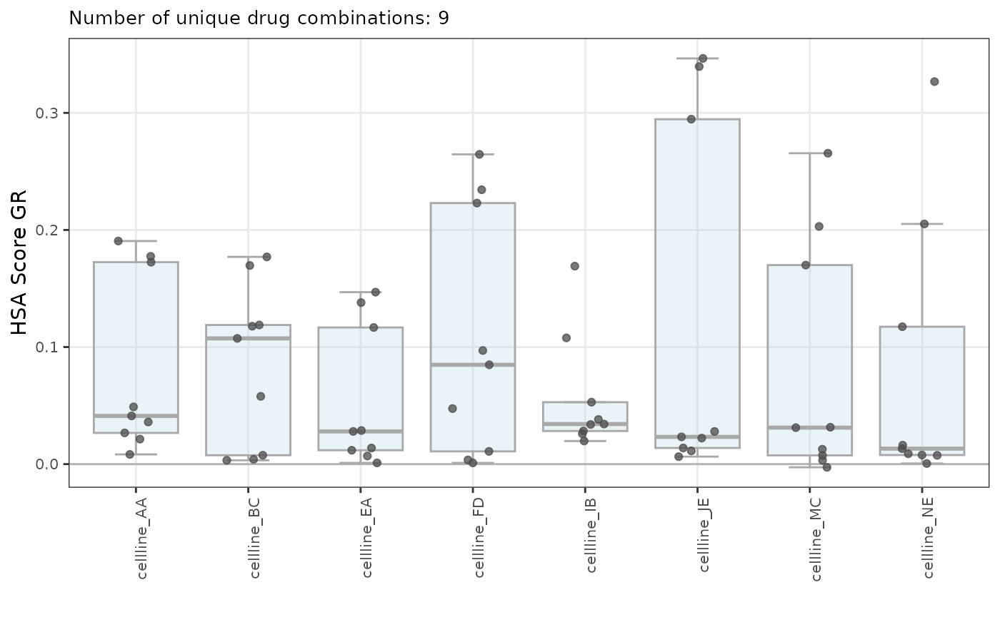

``` r
plot_boxplot_metric_combo_by_drugs(dt_scores)
```

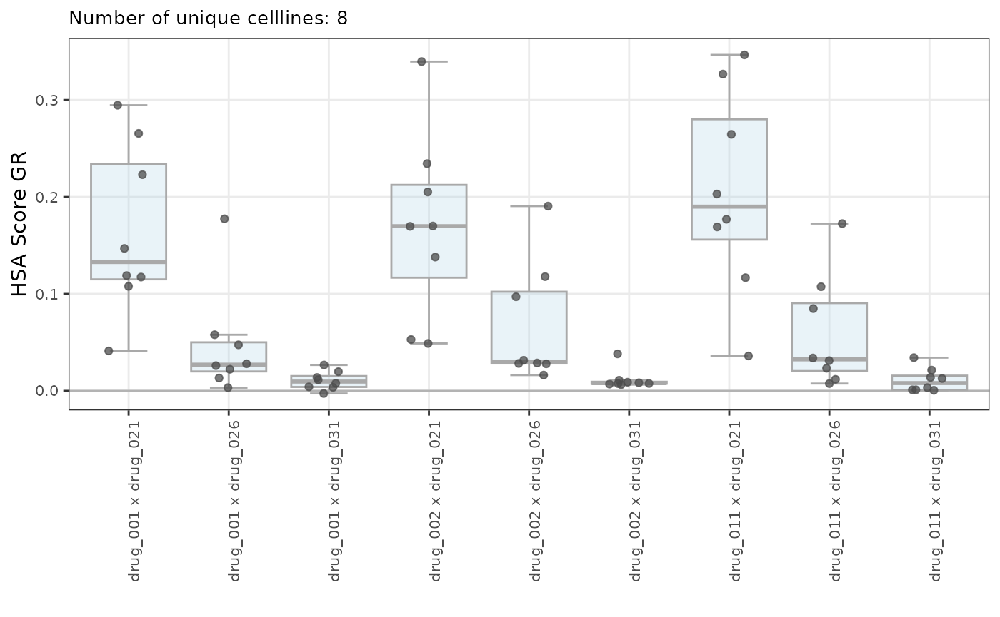

There is also a possibility to generate boxplot grouped by chosen
variable for dedicated `DrugName` or `CellLineName`. Additionally, the
n-top points are colored.

``` r
plot_boxplot_metric_combo_by_grp(dt_scores,
                                 selection_var = "DrugName",
                                 selection_name = c("drug_002", "drug_026"),
                                 group_var = "Tissue",
                                 named_n = 3)
```

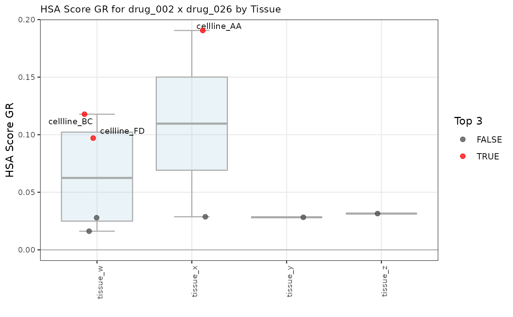

``` r
plot_boxplot_metric_combo_by_grp(dt_scores,
                                 selection_var = "CellLineName",
                                 selection_name = "cellline_BC",
                                 group_var = "drug_moa_2",
                                 named_n = 3)
```

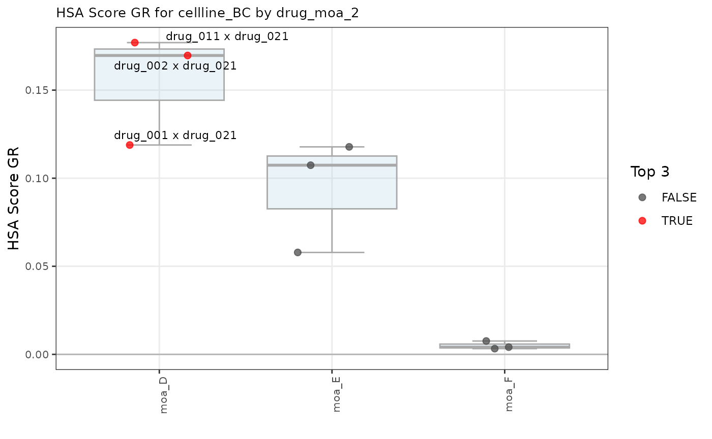

For experiments with drug combinations, users can visualize the full
response matrix by using **heatmap_combo_metrics** function.

Users get at once a view with smooth value, HSA (highest single-agent)
excess, or Bliss excess for selected normalization type across
combinations of concentrations, with isobolograms overlaid. Further, the
CI plot is also shown (the Combination Index is displayed at different
ratios of the two drugs).

Users can also use **heatmap_combo_metrics_panel** to get a panel with
heatmaps for all combo metrics, with isobolograms overlaid. The CI plot
is also shown (the Combination Index is displayed at different ratios of
the two drugs).

Note that by default, this function returns a panel, but it can also
return a list with the panel’s items (param `as_list = TRUE`).

``` r
heatmap_combo_metrics(dt_excess = dt_excess,
                      dt_isobolograms = dt_isobolograms,
                      drug1_name = "drug_001",
                      drug2_name = "drug_026",
                      cl_name = "cellline_NE",
                      iso_levels = "0.5",
                      metric = "smooth")
```

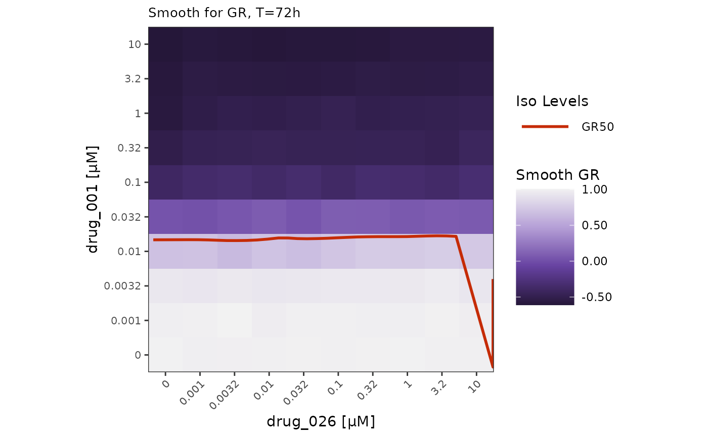

``` r

heatmap_combo_metrics(dt_excess = dt_excess,
                      dt_isobolograms = dt_isobolograms,
                      drug1_name = "drug_001",
                      drug2_name = "drug_026",
                      cl_name = "cellline_NE",
                      iso_levels = "0.5",
                      metric = "hsa_excess")
```

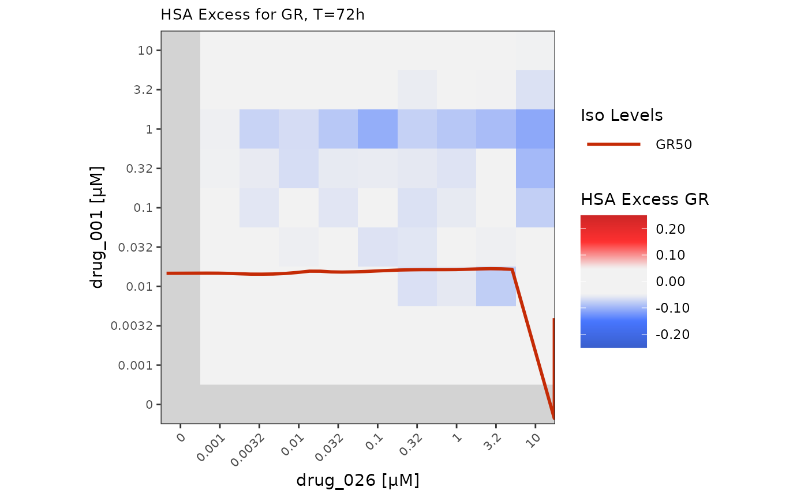

``` r

heatmap_combo_metrics(dt_excess = dt_excess,
                      dt_isobolograms = dt_isobolograms,
                      drug1_name = "drug_001",
                      drug2_name = "drug_026",
                      cl_name = "cellline_NE",
                      iso_levels = "0.5",
                      metric = "bliss_excess")
```

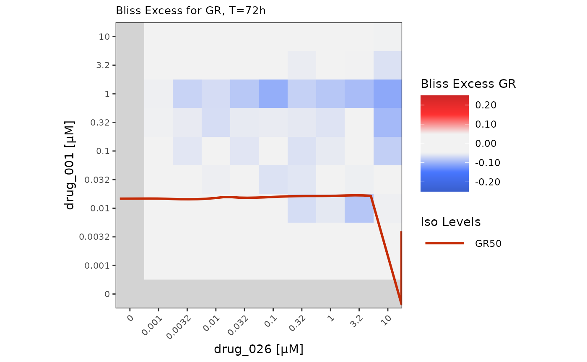

The **plot_combination_index** function allows users to explore the
dose-sparing effects for experiments with drug combinations. The
Combination Index is displayed at different ratios of the two drugs.

``` r
plot_combination_index(dt_excess = dt_excess,
                       dt_isobolograms = dt_isobolograms,
                       drug1_name = "drug_001",
                       drug2_name = "drug_026",
                       cl_name = "cellline_NE",
                       iso_levels = c("0.2", "0.5", "0.8"))
```

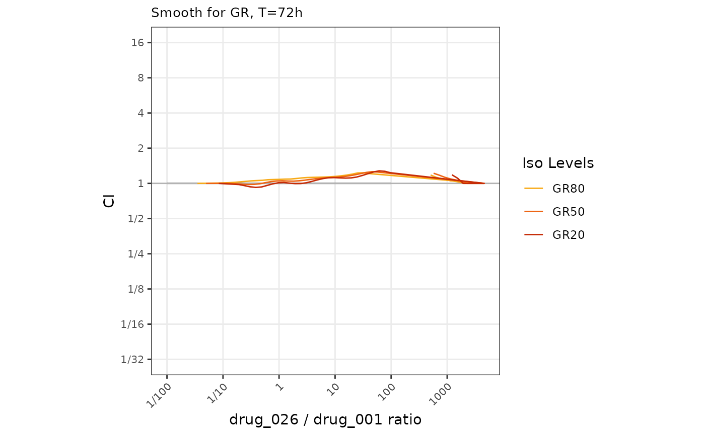

The **heatmap_combo_with_isoref** function allows users to explore the
reference isobolograms (additive Loewe model) compared to the measured
isobolograms on the background of smooth value of normalization type.

Users can also use **heatmap_combo_with_isoref_panel** to get a panel
with heatmap for selected drug name and co-drug name and list of cell
line names.

``` r
heatmap_combo_with_isoref(dt_excess = dt_excess,
                          dt_isobolograms = dt_isobolograms,
                          drug1_name = "drug_001",
                          drug2_name = "drug_026",
                          cl_name = "cellline_NE",
                          iso_levels = c("0.2", "0.5", "0.8"))
```

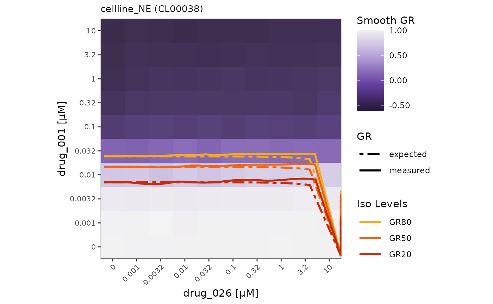

### Quality Control

This group of functions is very useful during processing raw data from
experiments into the gDR model through the gDR pipeline (for more
details visit [gDRcore
article](https://www.bioconductor.org/packages/release/bioc/vignettes/gDRcore/inst/doc/gDRcore.html)).

Users can control data quality at each processing step.

Also, when using the gDR model, the same control might be performed for
the corresponding assay.

#### Merging of Manifest, Treatment and Raw data using gDRimport

Before running the gDR pipeline, data are imported using the gDRimport
package. This package facilitates the loading of data from Envision,
Tecan, and other technologies. More information about the supported
technologies and examples of how to import data can be found in our
documentation.

The `plot_plate_stack_info` and `plot_plate` functions allow for
visualizing the plate design of the experiment. The
`plot_plate_stack_info` function shows all the plate information on a
single plot, while the plot_plate function displays information for a
single plate on the plot.

``` r
# Load test data using gDRimport
td <- gDRimport::get_test_data()

# Load data from manifest, template, and results files
l_tbl <- gDRimport::load_data(
  manifest_file = gDRimport::manifest_path(td),
  df_template_files = gDRimport::template_path(td),
  results_file = gDRimport::result_path(td)
)

# Merge the manifest, treatments, and raw data
merged_data <- gDRcore::merge_data(
  l_tbl$manifest,
  l_tbl$treatments,
  l_tbl$data
)

# Visualize the plate design of the experiment
plate_stack_vis <- plot_plate_stack_info(merged_data)
plate_vis <- plot_plate(merged_data, "ReadoutValue")
plate_stack_vis[["201904197a"]]
plate_vis[["201904197a"]]
```

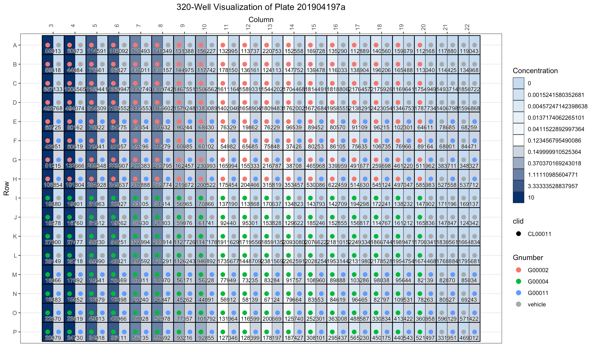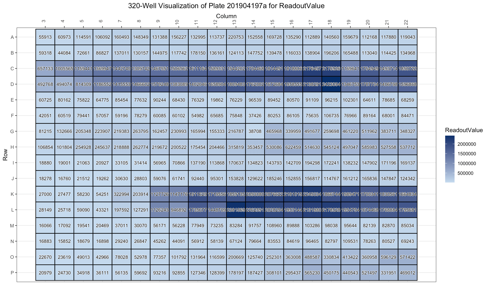

#### Mapping Controls to Treated

The first stage of the gDR pipeline involves dispatching the raw data
and controls into the appropriate nested tables.

The **heatmap_control_mapping_qc** function is dedicated to
single-agent, co-dilution and combination experiments.

It allows to visually check whether the raw data and the control are
correct and have been correctly assigned and nothing is missing.

``` r
dt_treat <-
  gDRutils::convert_se_assay_to_dt(se_sa,
                                   assay_name = "RawTreated",
                                   unify_metadata = TRUE,
                                   merge_additional_variables = TRUE)
dt_controls <-
  gDRutils::convert_se_assay_to_dt(se_sa,
                                   assay_name = "Controls",
                                   unify_metadata = TRUE,
                                   merge_additional_variables = TRUE)

heatmap_control_mapping_qc(dt_treat = dt_treat,
                           dt_controls = dt_controls)
```


``` r

dt_treat <-
  gDRutils::convert_se_assay_to_dt(se_combo,
                                   assay_name = "RawTreated",
                                   unify_metadata = TRUE,
                                   merge_additional_variables = TRUE)
dt_controls <-
  gDRutils::convert_se_assay_to_dt(se_combo,
                                   assay_name = "Controls",
                                   unify_metadata = TRUE,
                                   merge_additional_variables = TRUE)

heatmap_control_mapping_qc(dt_treat = dt_treat,
                           dt_controls = dt_controls)
```


#### Degree of Errors in Normalization Values

In the gDR pipeline during the normalization stage, the raw data are
normalized based on the control.

The **plot_var_distribution_qc** function is dedicated to single-agent,
co-dilution and combination experiments.

It allows to visually check whether the data distribution after
normalization is correct and as expected on a set of violin plots by
drug names.

``` r
plot_var_distribution_qc(dt_assay = dt_norm_sa,
                         cl_name = "cellline_NE")
```

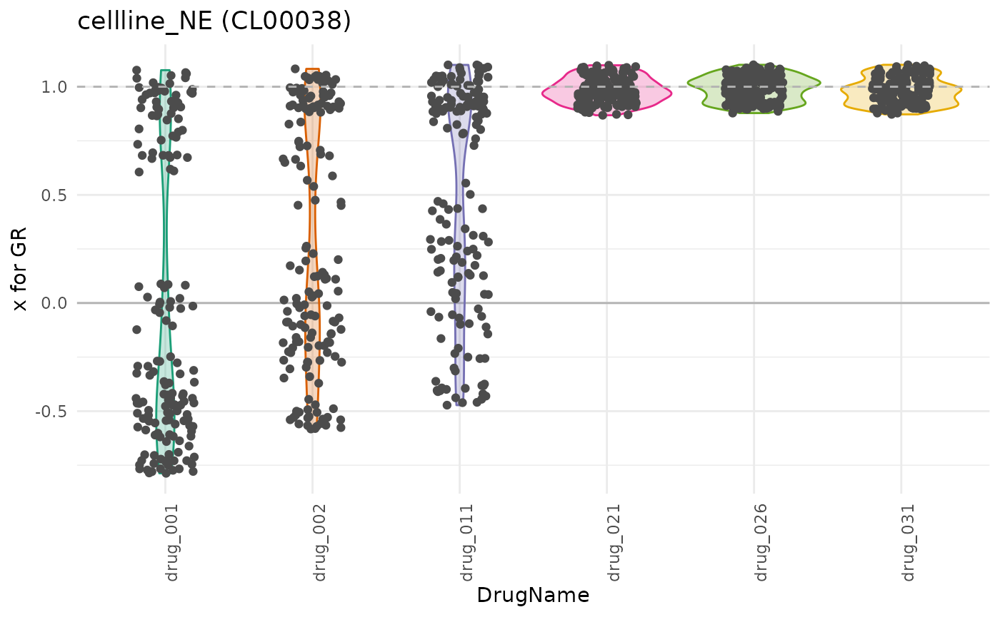

``` r
plot_var_distribution_qc(dt_assay = dt_norm_cd,
                         cl_name = "cellline_BA")
```

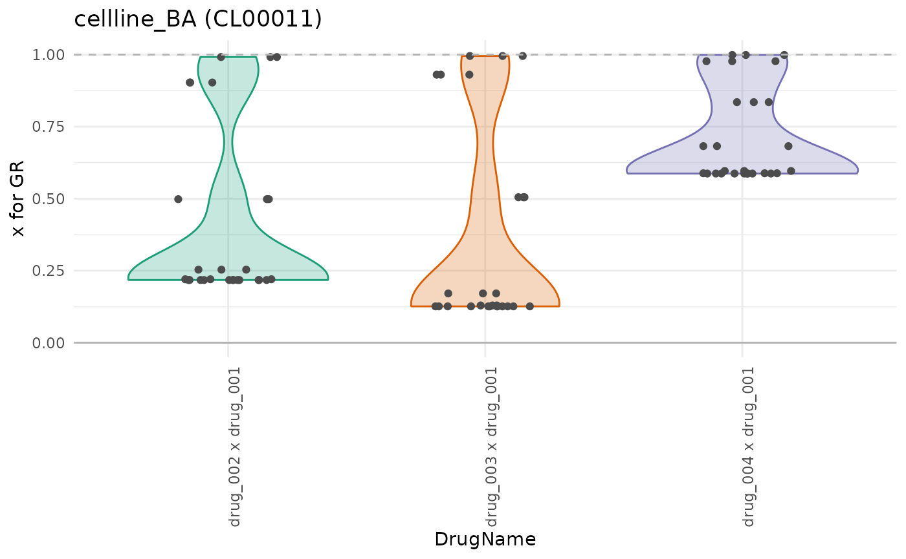

``` r
plot_var_distribution_qc(dt_assay = dt_norm_combo,
                         cl_name = "cellline_NE")
```

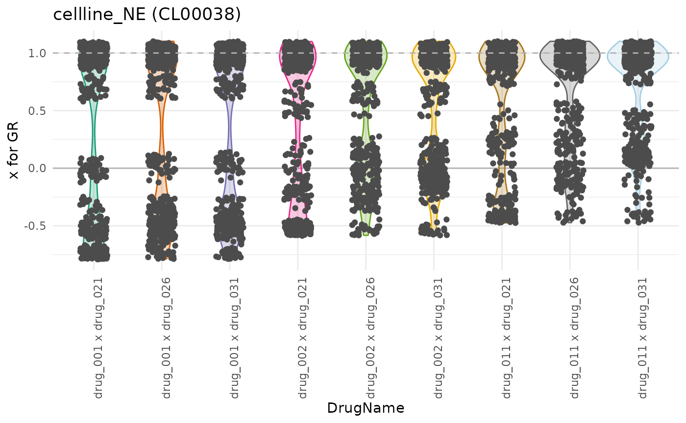

#### Averaged Values

In the gDR pipeline during the averaging stage, technical replicates
that are stored in the same nested table are averaged.

The **pheatmap_qc** function is dedicated to single-agent, co-dilution
and combination experiments.

It allows to visually check whether the average values of selected
metrics are as expected.

The control heatmap is built for selected cell line names and drugs (for
the combination experiment - also for co-drug) that are ordered by
concentration.

``` r
hm_sa <- pheatmap_qc(dt_average = dt_average_sa)
ggpubr::as_ggplot(hm_sa[["gtable"]])
```

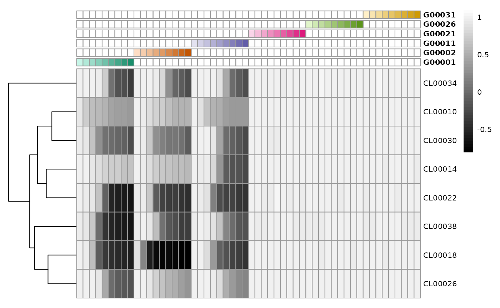

``` r
hm_cd <- pheatmap_qc(dt_average = dt_average_cd)
ggpubr::as_ggplot(hm_cd[["gtable"]])
```

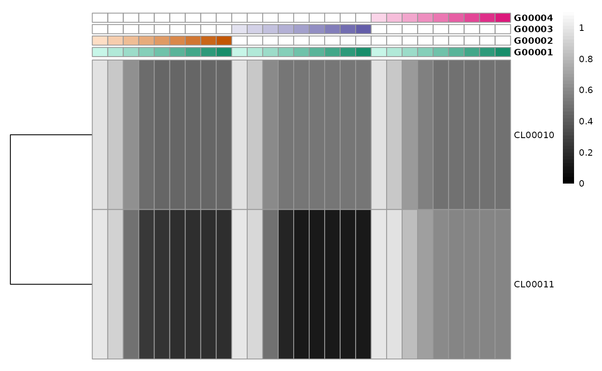

``` r
hm_combo <- pheatmap_qc(dt_average = dt_average_combo)
ggpubr::as_ggplot(hm_combo[["gtable"]])
```

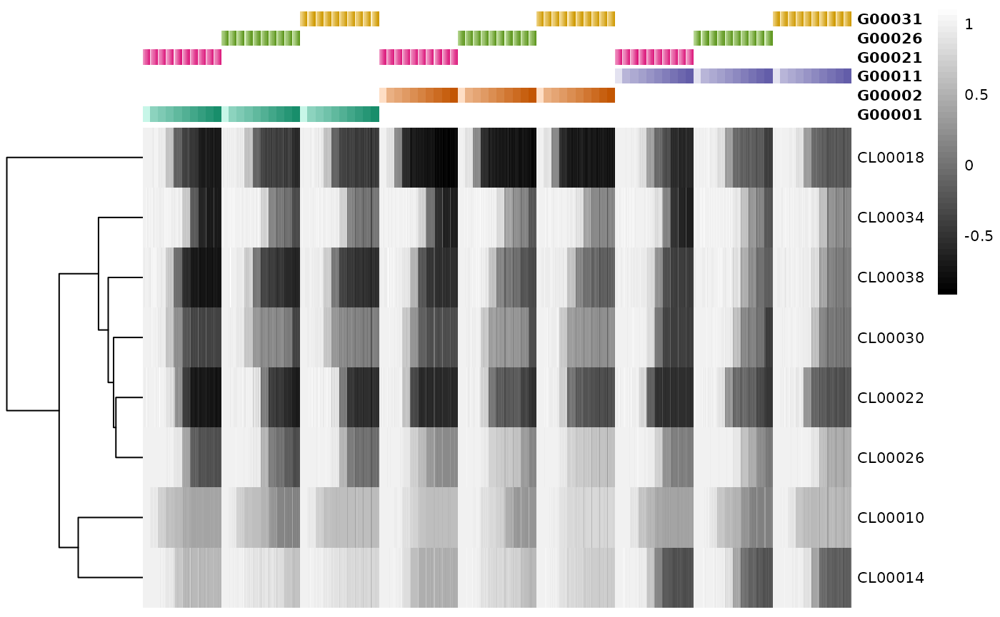

#### Accuracy of Fitting Dose-response Curves

In the gDR pipeline during the fitting stage, the dose-response curves
are fitted and the response metrics for each normalization type are
calculated.

The **plot_dose_response_sa_qc** function is dedicated to single-agent
experiments.

It allows to visually check whether the fitted dose-response curves
reflect correctly the measured data after normalization.

Users can also use **plot_dose_response_sa_qc_panel** to get a panel
with the dose-response curves - fitted and averaged - for list of cell
line names.

``` r
plot_dose_response_sa_qc(dt_metrics = dt_metrics_sa,
                         dt_average = dt_average_sa,
                         cl_name = "cellline_AA",
                         d_name = "drug_001")
```

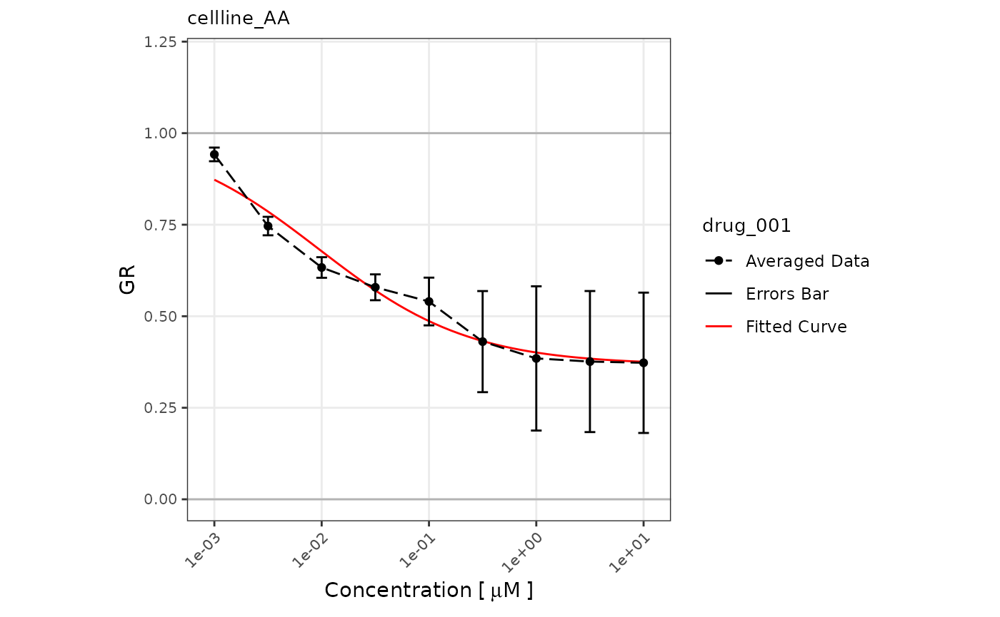

#### Quality Control - Fitting Precision

The **plot_var_stat_qc** function is dedicated to single-agent
experiments.

It allows to visually check values for the selected metric (from *metric
assay*) and selected cell line name on lollipop plots by the list of
drugs.

``` r
plot_var_stat_qc(dt_assay = dt_metrics_sa,
                 cl_name = "cellline_AA",
                 metric = "x_mean")
```

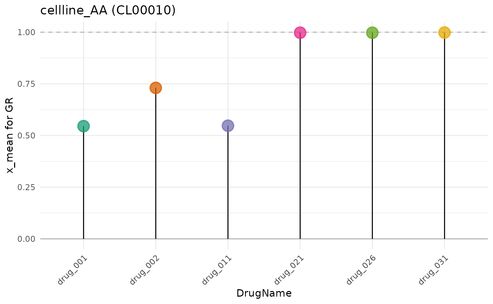

The **plot_fitting_acc** function is dedicated to single-agent
experiments.

It allows to visually check the fitting precision (`R2` and `RSS` values
on one panel) on lollipop plots for selected cell line name by the list
of drugs.

``` r
plot_fitting_acc(dt_assay = dt_metrics_sa,
                 cl_name = "cellline_EA")
```

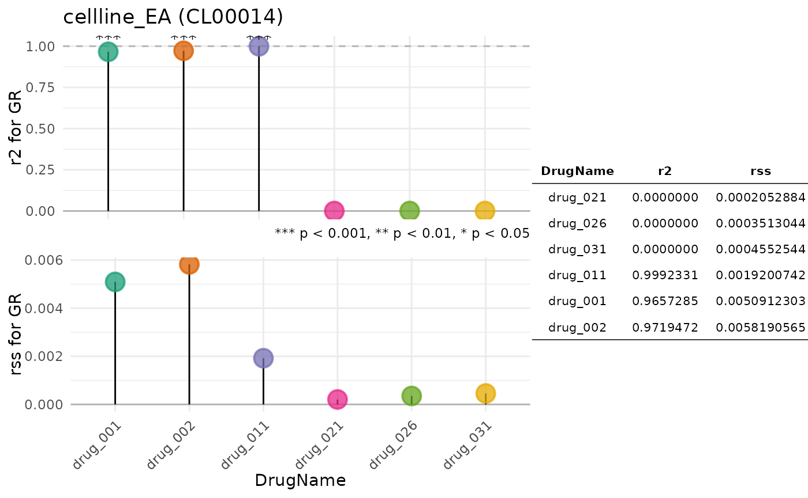

### Correlation between PRISM and DepMap

#### Volcano plot

The **plot_volcano_assoc** function is dedicated to PRISM experiments.
This function returns the volcano plot with associations between the
molecular features or the metadata and readout of interest.

*Note*: It requires dedicated input calculated with `prep_dt_assoc`
function.

Users can also use **plot_volcano_assoc_panel** to get a panel with the
volcano plot and scatter plots or box plots for interesting variables -
according to the type of data (numerical feature or categorical feature,
respectively).

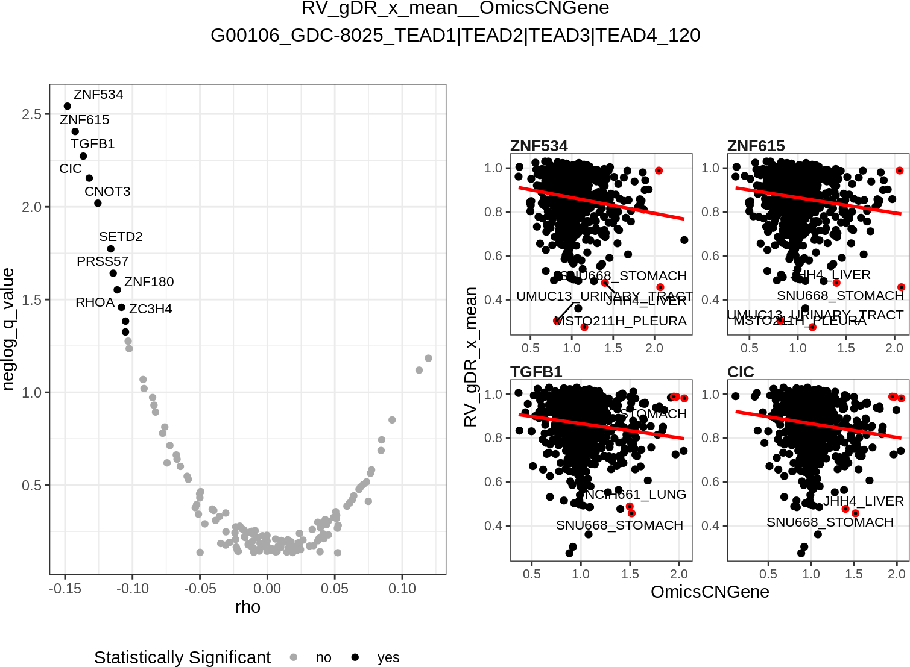

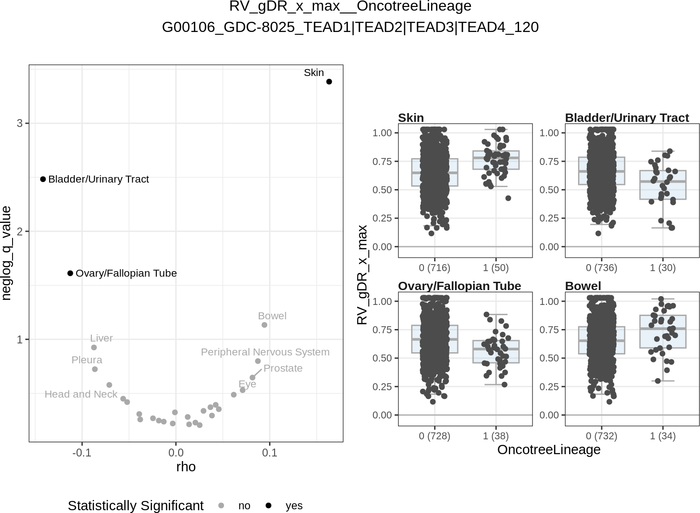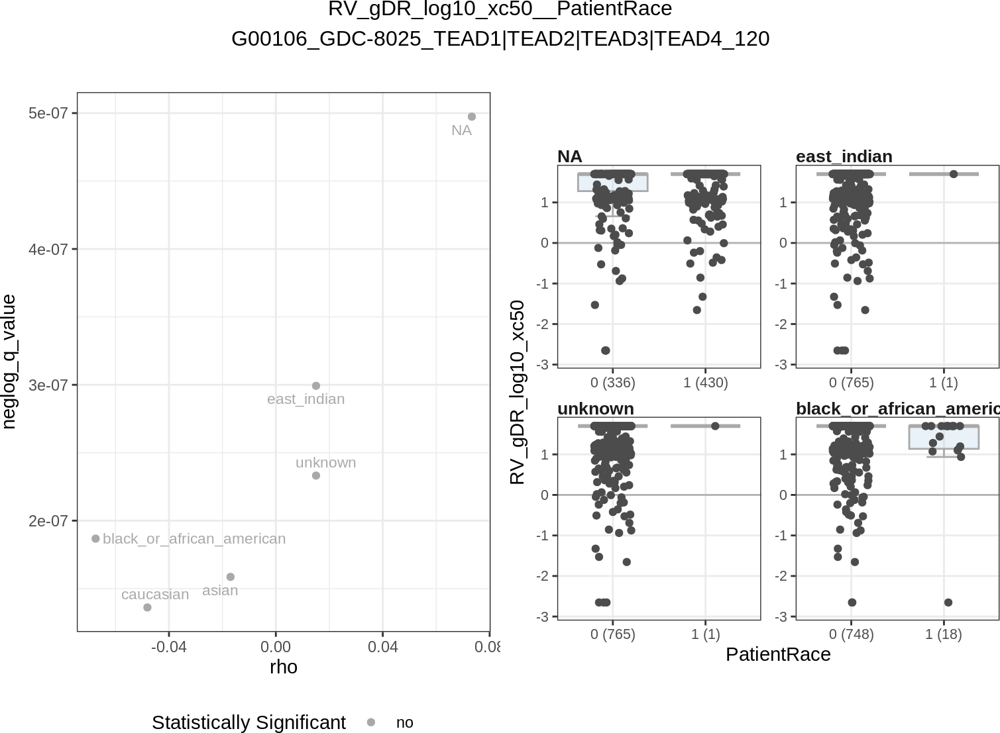

#### Scatter plots with correlations

Users can explore more detailed correlation between one selected feature
and selected metric using **plot_scatter_with_corr** function.

*Note*: It requires dedicated input calculated with
`prep_dt_depmap_feat` function and one of the functions with
experimental response data for one metric: `prep_dt_response_metric_sa`,
`prep_dt_response_dose_sa`, `prep_dt_response_scores` or
`prep_dt_response_metric_diff`.

Users can also use **plot_scatter_with_corr_panel** to get a panel with
the scatter plot with correlation for list of the DepMap features as a
table.

#### Boxplots

Users can explore more detailed distribution of selected metric for
selected level of metadata using **plot_boxplot_num** function.

Users can also use **plot_boxplot_num_panel** to get a panel with the
box plot with category distribution for list of the DepMap matadata.

Users can also explore more detailed distribution for all lveles of
selected metadata and selected metric using **plot_boxplot_meta**
function.

*Note*: It requires dedicated input calculated with
`prep_dt_depmap_meta` function and one of the functions with
experimental response data for one metric: `prep_dt_response_metric_sa`,
`prep_dt_response_dose_sa`, `prep_dt_response_scores` or
`prep_dt_response_metric_diff`.

## SessionInfo

``` r
sessionInfo()
#> R version 4.6.0 (2026-04-24)
#> Platform: x86_64-pc-linux-gnu
#> Running under: Ubuntu 24.04.4 LTS
#> 
#> Matrix products: default
#> BLAS:   /usr/lib/x86_64-linux-gnu/openblas-pthread/libblas.so.3 
#> LAPACK: /usr/lib/x86_64-linux-gnu/openblas-pthread/libopenblasp-r0.3.26.so;  LAPACK version 3.12.0
#> 
#> locale:
#>  [1] LC_CTYPE=C.UTF-8       LC_NUMERIC=C           LC_TIME=C.UTF-8       
#>  [4] LC_COLLATE=C.UTF-8     LC_MONETARY=C.UTF-8    LC_MESSAGES=C.UTF-8   
#>  [7] LC_PAPER=C.UTF-8       LC_NAME=C              LC_ADDRESS=C          
#> [10] LC_TELEPHONE=C         LC_MEASUREMENT=C.UTF-8 LC_IDENTIFICATION=C   
#> 
#> time zone: UTC
#> tzcode source: system (glibc)
#> 
#> attached base packages:
#> [1] stats     graphics  grDevices utils     datasets  methods   base     
#> 
#> other attached packages:
#> [1] gDRplots_0.0.113 BiocStyle_2.40.0
#> 
#> loaded via a namespace (and not attached):
#>  [1] tidyselect_1.2.1            dplyr_1.2.1                
#>  [3] farver_2.1.2                S7_0.2.2                   
#>  [5] fastmap_1.2.0               BumpyMatrix_1.20.0         
#>  [7] stringfish_0.19.0           digest_0.6.39              
#>  [9] lifecycle_1.0.5             gDRutils_1.10.0            
#> [11] magrittr_2.0.5              compiler_4.6.0             
#> [13] rlang_1.2.0                 sass_0.4.10                
#> [15] tools_4.6.0                 yaml_2.3.12                
#> [17] data.table_1.18.4           knitr_1.51                 
#> [19] ggsignif_0.6.4              S4Arrays_1.12.0            
#> [21] labeling_0.4.3              htmlwidgets_1.6.4          
#> [23] DelayedArray_0.38.2         RColorBrewer_1.1-3         
#> [25] abind_1.4-8                 withr_3.0.2                
#> [27] purrr_1.2.2                 BiocGenerics_0.58.1        
#> [29] desc_1.4.3                  grid_4.6.0                 
#> [31] stats4_4.6.0                ggpubr_0.6.3               
#> [33] colorspace_2.1-2            ggplot2_4.0.3              
#> [35] scales_1.4.0                MultiAssayExperiment_1.38.0
#> [37] SummarizedExperiment_1.42.0 cli_3.6.6                  
#> [39] rmarkdown_2.31              ragg_1.5.2                 
#> [41] generics_0.1.4              otel_0.2.0                 
#> [43] RcppParallel_5.1.11-2       cachem_1.1.0               
#> [45] stringr_1.6.0               BiocManager_1.30.27        
#> [47] XVector_0.52.0              matrixStats_1.5.0          
#> [49] vctrs_0.7.3                 Matrix_1.7-5               
#> [51] jsonlite_2.0.0              carData_3.0-6              
#> [53] bookdown_0.47               car_3.1-5                  
#> [55] IRanges_2.46.0              S4Vectors_0.50.1           
#> [57] ggrepel_0.9.8               rstatix_0.7.3              
#> [59] Formula_1.2-5               systemfonts_1.3.2          
#> [61] jquerylib_0.1.4             tidyr_1.3.2                
#> [63] glue_1.8.1                  pkgdown_2.2.0              
#> [65] cowplot_1.2.0               stringi_1.8.7              
#> [67] gtable_0.3.6                GenomicRanges_1.64.0       
#> [69] tibble_3.3.1                pillar_1.11.1              
#> [71] htmltools_0.5.9             Seqinfo_1.2.0              
#> [73] R6_2.6.1                    textshaping_1.0.5          
#> [75] evaluate_1.0.5              lattice_0.22-9             
#> [77] Biobase_2.72.0              backports_1.5.1            
#> [79] pheatmap_1.0.13             broom_1.0.13               
#> [81] bslib_0.11.0                Rcpp_1.1.1-1.1             
#> [83] gridExtra_2.3               SparseArray_1.12.2         
#> [85] checkmate_2.3.4             qs2_0.2.2                  
#> [87] xfun_0.58                   fs_2.1.0                   
#> [89] MatrixGenerics_1.24.0       pkgconfig_2.0.3
```
