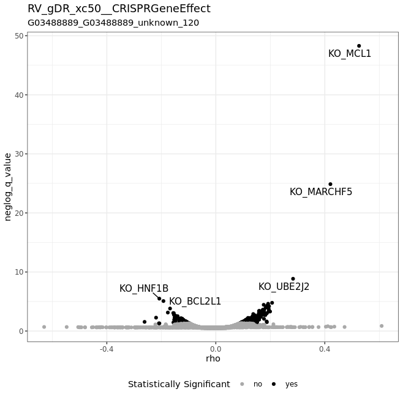
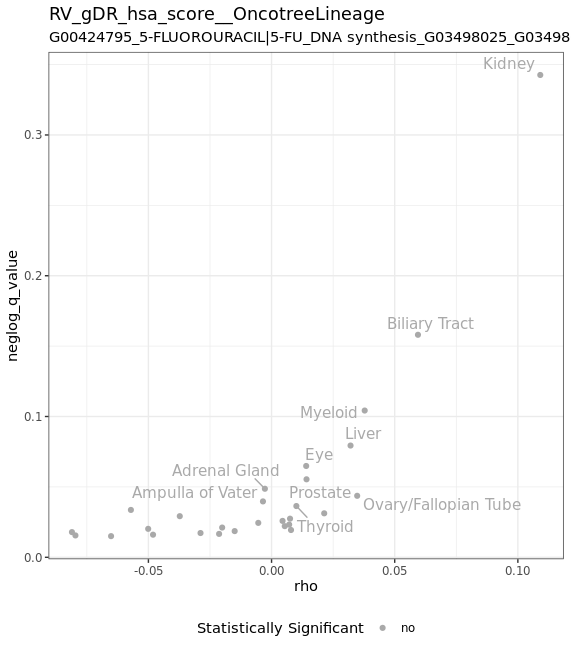
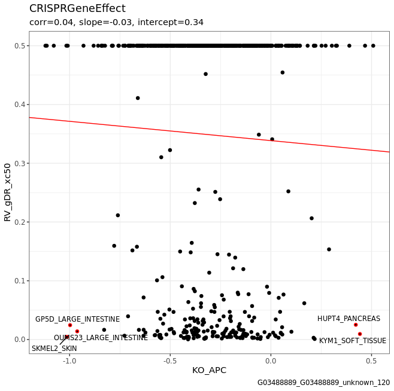
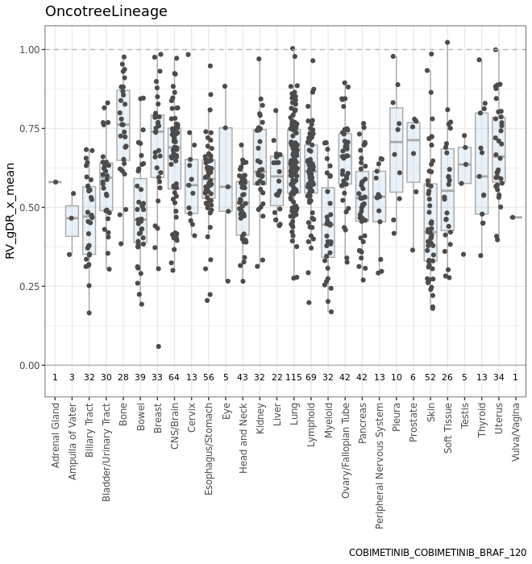

  
```{r set, include = FALSE}
knitr::opts_chunk$set(
  collapse = TRUE,
  comment = "#>"
)
```

```{r lib, echo=FALSE}
library(gDRplots)
```

# Overview

The `gDRplots` package belongs to the `gDR` suite app. 

# Content

The `gDRplots` package is de to store functions for gDR static visualizations and their dedicated helpers. The package allows users to visualize different metrics for combinations of drugs and cell lines of interest, both during and after processing.

The `gDRplots` package supports the following metrics: 

| Metrics | Definition |
| ---- | ---------- |
| **GR value** | Normalized Growth Rate (GR) value; calculated by normalizing treated samples with the corresponding vehicle-treated samples. |
| **Relative Viability** | (RV); calculated by normalizing treated samples with the corresponding vehicle-treated samples. |

*Note* All plot functions require as an input data.table representation of the data in selected assay with added information from `colData` created based on the gDR data model (MultiAssayExperiment). More details about the gDR data model user can find in the [gDRcore](https://www.bioconductor.org/packages/release/bioc/html/gDRcore.html){target="_blank"} package.

Used data:

```{r sa_data, warning = FALSE, message = FALSE}
mae <- gDRutils::get_synthetic_data("combo_matrix")
se_sa <- mae[[gDRutils::get_supported_experiments("sa")]]

dt_norm_sa <- 
  gDRutils::convert_se_assay_to_dt(se = se_sa,
                                   assay_name =  "Normalized")
dt_metrics_sa <- 
  gDRutils::convert_se_assay_to_dt(se = se_sa,
                                   assay_name = "Metrics")
dt_average_sa <- 
  gDRutils::convert_se_assay_to_dt(se = se_sa,
                                   assay_name = "Averaged")
```

```{r cd_data, warning = FALSE, message = FALSE}
mae <- gDRutils::get_synthetic_data("combo_codilution_small")
se_cd <- mae[[gDRutils::get_supported_experiments("cd")]]

dt_norm_cd <- 
  gDRutils::convert_se_assay_to_dt(se = se_cd,
                                   assay_name =  "Normalized")
dt_metrics_cd <- 
  gDRutils::convert_se_assay_to_dt(se = se_cd,
                                   assay_name = "Metrics")
dt_average_cd <- 
  gDRutils::convert_se_assay_to_dt(se = se_cd,
                                   assay_name = "Averaged")
```

```{r combo_data, warning = FALSE, message = FALSE}
mae <- gDRutils::get_synthetic_data("combo_matrix")
se_combo <- mae[[gDRutils::get_supported_experiments("combo")]]

dt_norm_combo <- 
  gDRutils::convert_se_assay_to_dt(se = se_combo,
                                   assay_name =  "Normalized")
dt_metrics_combo <- 
  gDRutils::convert_se_assay_to_dt(se = se_combo, 
                                   assay_name = "Metrics")
dt_average_combo <- 
  gDRutils::convert_se_assay_to_dt(se = se_combo, 
                                   assay_name = "Averaged")
dt_scores <- 
  gDRutils::convert_se_assay_to_dt(se = se_combo,
                                   assay_name = "scores")
dt_excess <- 
  gDRutils::convert_se_assay_to_dt(se = se_combo,
                                   assay_name = "excess")
dt_isobolograms <- 
  gDRutils::convert_se_assay_to_dt(se = se_combo,
                                   assay_name = "isobolograms")
```

## Dose Response Plots

The dose-response plots are classic visualizations of drug response curves in a consolidated way. 

The overview with many curves presented on the same scale gives the user a comprehensive view of the dataset. This is particularly useful in large compound screening datasets, where a drug with a universal resistance pattern across all cell lines can be easily identified. The compound generates different sigmoid curves, suggesting inhibitory or cytotoxic effects, which are worth exploring further.

### Single-agent Data

The **plot_dose_response_sa** function is dedicated to single-agent experiments.

Users can also use  **plot_dose_response_sa_by_CLs** or **plot_dose_response_sa_by_drugs** to get a list of dose-response plots by cell line names or by drugs accordingly.

```{r plot_dose_response_sa, warning = FALSE, message = FALSE}
plot_dose_response_sa(
  dt_metrics = dt_metrics_sa,
  dt_average = dt_average_sa,
  selection_name = "drug_002",
  group_var = "CellLineName",
  group_names = c("cellline_BC", "cellline_FD", "cellline_JE"))
```

### Combination Data

The **plot_dose_response_combo** function is dedicated to combination experiments.

Users can also use **plot_dose_response_combo_panel** to get a panel with dose-response plots by selected cell line name.

```{r plot_dose_response_combo, warning = FALSE, message = FALSE}
plot_dose_response_combo(dt_average = dt_average_combo,
                         drug1_name = "drug_011",
                         drug2_name = "drug_021",
                         cl_name = "cellline_NE")
```

## Metrics plot

A heat map built for all combinations of drugs and cell lines, colored according to the value of the selected metric, is a very common way to explore datasets.

### Single-agent Data

The **pheatmap_with_anno_sa** function is dedicated to single-agent experiments.

Additionally, rows are annotated by `Tissue` and columns - by `drug MOA`. Users can also use their own annotations.

This function returns the heatmap itself and a list of tables with data: a matrix and annotation vectors.

```{r pheatmap_with_anno_sa, warning = FALSE, message = FALSE}
annotation_manual_col <-
  unique(dt_metrics_sa[, c("CellLineName", "Tissue"), with = FALSE])
annotation_manual_row <-
  unique(dt_metrics_sa[, c("DrugName", "drug_moa"), with = FALSE])

output <- pheatmap_with_anno_sa(
  dt_metrics = dt_metrics_sa,
  annotation_row = annotation_manual_row,
  annotation_col = annotation_manual_col)
hm <- output[["heatmap"]]
ggpubr::as_ggplot(hm[["gtable"]])

knitr::kable(output[["data"]][["matrix"]], escape = FALSE)
```

### Co-dilution Data

The **pheatmap_with_anno_cd** function is dedicated to co-dilution experiments.

Additionally, rows are annotated by `Tissue` and columns - by `drug MOA` and `drug MOA 2`. Users can also use their own annotations.

This function returns the heatmap itself and a list of tables with data: a matrix and annotation vectors.

```{r pheatmap_with_anno_cd, warning = FALSE, message = FALSE}
annotation_manual_col <-
  unique(dt_metrics_cd[, c("CellLineName", "Tissue"), with = FALSE])
annotation_manual_row <-
  unique(dt_metrics_cd[, c("DrugName", "DrugName_2", "Concentration_2",
                           "drug_moa", "drug_moa_2"), with = FALSE])

output <- pheatmap_with_anno_cd(
  dt_metrics = dt_metrics_cd,
  annotation_row = annotation_manual_row,
  annotation_col = annotation_manual_col)
hm <- output[["heatmap"]]
ggpubr::as_ggplot(hm[["gtable"]])

knitr::kable(output[["data"]][["matrix"]], escape = FALSE)
```

### Combination Data

The **pheatmap_with_anno_combo** function is dedicated to combination experiments.

Additionally, rows are annotated by `Tissue` and columns - by `drug MOA` and `co-drug MOA`. Users can also use their own annotations.

This function returns the heatmap itself and a list of tables with data: a matrix and annotation vectors.

```{r pheatmap_with_anno_combo, warning = FALSE, message = FALSE}
annotation_manual_col <-
  unique(dt_scores[, c("CellLineName", "Tissue"), with = FALSE])
annotation_manual_row <-
  unique(dt_scores[, c("DrugName", "DrugName_2", 
                       "drug_moa", "drug_moa_2"), with = FALSE])

output <- pheatmap_with_anno_combo(
  dt_scores = dt_scores,
  annotation_row = annotation_manual_row,
  annotation_col = annotation_manual_col)
hm <- output[["heatmap"]]
ggpubr::as_ggplot(hm[["gtable"]])

knitr::kable(output[["data"]][["matrix"]], escape = FALSE)
```

For experiments with drug combinations, users can visualize the full response matrix by using **heatmap_combo_metrics** function. 

Users get at once a view with smooth value, HSA (highest single-agent) excess, or Bliss excess for selected normalization type across combinations of concentrations, with isobolograms overlaid. Further, the CI plot is also shown (the Combination Index is displayed at different ratios of the two drugs).

Users can also use **heatmap_combo_metrics_panel** to get a panel with heatmaps for all combo metrics, with isobolograms overlaid. The CI plot is also shown (the Combination Index is displayed at different ratios of the two drugs).

Note that by default, this function returns a panel, but it can also return a list with the panel's items.

```{r heatmap_combo_metrics_panel, warning = FALSE, message = FALSE}
heatmap_combo_metrics(dt_excess = dt_excess,
                      dt_isobolograms = dt_isobolograms,
                      drug1_name = "drug_001", 
                      drug2_name = "drug_026",
                      cl_name = "cellline_NE",
                      iso_levels = "0.5",
                      metric = "smooth")

heatmap_combo_metrics(dt_excess = dt_excess,
                      dt_isobolograms = dt_isobolograms,
                      drug1_name = "drug_001", 
                      drug2_name = "drug_026",
                      cl_name = "cellline_NE",
                      iso_levels = "0.5",
                      metric = "hsa_excess")

heatmap_combo_metrics(dt_excess = dt_excess,
                      dt_isobolograms = dt_isobolograms,
                      drug1_name = "drug_001", 
                      drug2_name = "drug_026",
                      cl_name = "cellline_NE",
                      iso_levels = "0.5",
                      metric = "bliss_excess")
```

The **plot_combination_index** function allows users to explore the dose-sparing effects for experiments with drug combinations. The Combination Index is displayed at different ratios of the two drugs.

```{r plot_combination_index, warning = FALSE, message = FALSE}
plot_combination_index(dt_excess = dt_excess,
                          dt_isobolograms = dt_isobolograms,
                          drug1_name = "drug_001", 
                          drug2_name = "drug_026",
                          cl_name = "cellline_NE",
                          iso_levels = c("0.2", "0.5", "0.8"))
```

The **heatmap_combo_with_isoref** function allows users to explore the reference isobolograms (additive Loewe model) compared to the measured isobolograms on the background of smooth value of normalization type.

Users can also use **heatmap_combo_with_isoref_panel** to get a panel with heatmap for selected drug name and co-drug name and list of cell line names.

```{r heatmap_combo_with_isoref, warning = FALSE, message = FALSE}
heatmap_combo_with_isoref(dt_excess = dt_excess,
                          dt_isobolograms = dt_isobolograms,
                          drug1_name = "drug_001", 
                          drug2_name = "drug_026",
                          cl_name = "cellline_NE",
                          iso_levels = c("0.2", "0.5", "0.8"))
```


## Quality Control 

This group of functions is very useful during processing raw data from experiments into the gDR model through the gDR pipeline (for more details visit [gDRcore article](https://www.bioconductor.org/packages/release/bioc/vignettes/gDRcore/inst/doc/gDRcore.html){target="_blank"}). 

Users can control data quality at each processing step. 

Also, when using the gDR model, the same control might be performed for the corresponding assay.

### Mapping Controls to Treated

The first stage of the gDR pipeline involves dispatching the raw data and controls into the appropriate nested tables.

The **heatmap_control_mapping_qc** function is dedicated to single-agent, co-dilution and combination experiments.

It allows to visually check whether the raw data and the control are correct and have been correctly assigned and nothing is missing.

```{r heatmap_control_mapping_qc, warning = FALSE, message = FALSE}
dt_treat <- 
  gDRutils::convert_se_assay_to_dt(se_sa, 
                                   assay_name = "RawTreated")
dt_controls <- 
  gDRutils::convert_se_assay_to_dt(se_sa, 
                                   assay_name = "Controls")

heatmap_control_mapping_qc(dt_treat = dt_treat,
                           dt_controls = dt_controls)

dt_treat <- 
  gDRutils::convert_se_assay_to_dt(se_combo, 
                                   assay_name = "RawTreated")
dt_controls <- 
  gDRutils::convert_se_assay_to_dt(se_combo, 
                                   assay_name = "Controls")

heatmap_control_mapping_qc(dt_treat = dt_treat,
                           dt_controls = dt_controls)
```

### Degree of Errors in Normalization Values

In the gDR pipeline during the normalization stage, the raw data are normalized based on the control.

The **plot_var_distribution_qc** function is dedicated to single-agent, co-dilution and combination experiments.

It allows to visually check whether the data distribution after normalization is correct and as expected on a set of violin plots by drug names.

```{r plot_var_distribution_qc, warning = FALSE, message = FALSE}
plot_var_distribution_qc(dt_assay = dt_norm_sa,
                         cl_name = "cellline_NE")
plot_var_distribution_qc(dt_assay = dt_norm_cd,
                         cl_name = "cellline_BA")
plot_var_distribution_qc(dt_assay = dt_norm_combo,
                         cl_name = "cellline_NE")
```

### Averaged Values

In the gDR pipeline during the averaging stage, technical replicates that are stored in the same nested table are averaged.

The **pheatmap_qc** function is dedicated to single-agent, co-dilution and combination experiments.

It allows to visually check whether the average values of selected metrics are as expected. 

The control heatmap is built for selected cell line names and drugs (for the combination experiment - also for co-drug) that are ordered by concentration.

```{r pheatmap_qc_sa, warning = FALSE, message = FALSE}
hm_sa <- pheatmap_qc(dt_average = dt_average_sa)
ggpubr::as_ggplot(hm_sa[["gtable"]])
```

```{r pheatmap_qc_cd, warning = FALSE, message = FALSE}
hm_cd <- pheatmap_qc(dt_average = dt_average_cd)
ggpubr::as_ggplot(hm_cd[["gtable"]])
```

```{r pheatmap_qc_combo, warning = FALSE, message = FALSE}
hm_combo <- pheatmap_qc(dt_average = dt_average_combo)
ggpubr::as_ggplot(hm_combo[["gtable"]])
```

### Accuracy of Fitting Dose-response Curves

In the gDR pipeline during the fitting stage, the dose-response curves are fitted and the response metrics for each normalization type are calculated.

The **plot_dose_response_sa_qc** function is dedicated to single-agent experiments.

It allows to visually check whether the fitted dose-response curves reflect correctly the measured data after normalization.

Users can also use **plot_dose_response_sa_qc_panel** to get a panel with the dose-response curves - fitted and averaged - for list of cell line names.

```{r plot_dose_response_sa_qc, warning = FALSE, message = FALSE}
plot_dose_response_sa_qc(dt_metrics = dt_metrics_sa,
                         dt_average = dt_average_sa,
                         cl_name = "cellline_AA",
                         d_name = "drug_001")
```

### Quality Control - Fitting Precision 

The **plot_var_stat_qc** function is dedicated to single-agent experiments.

It allows to visually check values for the selected metric (from _metric assay_) and selected cell line name on lollipop plots by the list of drugs.

```{r plot_var_stat_qc, warning = FALSE, message = FALSE}
plot_var_stat_qc(dt_assay = dt_metrics_sa,
                 cl_name = "cellline_AA",
                 metric = "x_mean")
```

The **plot_fitting_acc** function is dedicated to single-agent experiments.

It allows to visually check the fitting precision (`R2` and `RSS` values on one panel) on lollipop plots for selected cell line name by the list of drugs.

```{r plot_fitting_acc, warning = FALSE, message = FALSE}
plot_fitting_acc(dt_assay = dt_metrics_sa,
                 cl_name = "cellline_EA")
```

## Correlation between PRISM and DepMap

The **plot_volcano_assoc** function is dedicated to PRISM experiments. This function returns the volcano plot 
with associations between the molecular features or the metadata and readout of interest.

Note: It requires dedicated input calculated with `prep_dt_assoc` function.

Users can also use **plot_volcano_assoc_panel** to get a panel with the volcano plot and scatter plots or box plots for interesting variables - according to the type of data.





Users can also explore more detailed correlation between one selected feature and selected metric using **plot_scatter_with_corr** function.

Note: It requires dedicated input calculated with `prep_dt_depmap_feat` function and one of the functions
with experimental response data for one metric: `prep_dt_response_metric_sa`, `prep_dt_response_dose_sa`, `prep_dt_response_scores` or `prep_dt_response_metric_diff`. 

Users can also use **plot_scatter_with_corr_panel** to get a panel with the scatter plot with correlation 
for list of the DepMap features.



Users can also explore more detailed distribution of selected metadata and selected metric using **plot_boxplot_meta** function.



Note: It requires dedicated input calculated with `prep_dt_depmap_meta` function and one of the functions
with experimental response data for one metric: `prep_dt_response_metric_sa`, `prep_dt_response_dose_sa`, `prep_dt_response_scores` or `prep_dt_response_metric_diff`. 


# SessionInfo {-}

```{r sessionInfo}
sessionInfo()
```
